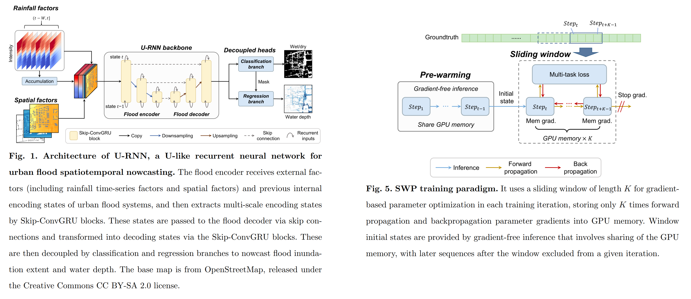
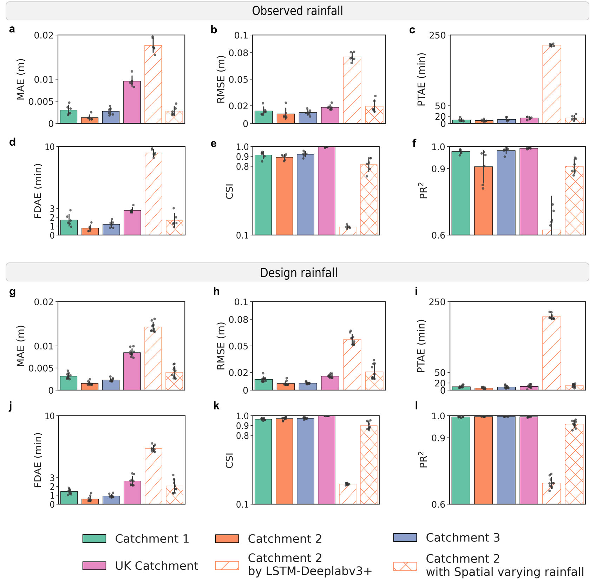

# [U-RNN: High-resolution Spatiotemporal Nowcasting of Urban Flooding](https://www.sciencedirect.com/science/article/pii/S002216942500455X?via%3Dihub)

<p align="center">
  <a href="https://www.sciencedirect.com/science/article/pii/S002216942500455X?via%3Dihub"></a>
  <a href="https://colab.research.google.com/drive/14pw_SjC9Xk7jqpJh2rktXzDajbpkPJoW?usp=sharing"></a>
  <a href="https://github.com/holmescao/U-RNN"></a>
  <a href="https://holmescao.github.io/datasets/urbanflood24"></a>
  <a href="https://drive.google.com/file/d/1tfwRJ3gFFTa0kiziVeo9xXsz0DaaJrJU/view?usp=drive_link"></a>
  <a href="https://huggingface.co/holmescao/U-RNN"></a>
</p>

<p align="center"><strong>English</strong> | <a href="README_CN.md">中文</a></p>

<p align="center"></p>
<p align="center"><em><strong>U-RNN vs. hydrodynamic solver — 100-year return-period rainfall event, location1.</strong> U-RNN delivers &gt;100× faster inference with high spatial accuracy at 2 m / 1 min resolution.</em></p>

**U-RNN** nowcasts urban flood inundation through time — predicting water-depth maps from rainfall and terrain at **2 m / 1 min** resolution, **>100× faster** than a physics-based hydrodynamic solver. It pairs a U-shaped ConvGRU encoder–decoder with a Sliding-Window Pre-warming (SWP) training paradigm for memory-efficient long-sequence learning.

> ⚡ **Just want to see it work?** Run the full pipeline in your browser in **< 2 min** — no GPU, no data download, no setup:
> [**▶ Open the Colab quickstart**](https://colab.research.google.com/drive/14pw_SjC9Xk7jqpJh2rktXzDajbpkPJoW?usp=sharing)
>
> 📚 **Want to reproduce the paper?** The complete step-by-step tutorials live in **[`tutorials/`](tutorials/README.md)** (English & 中文).

## 📰 News

- **[2026.05]** 🎉 Our follow-up work **[LarNO](https://github.com/holmescao/LarNO)** accepted by *Journal of Hydrology* ([DOI: 10.1016/j.jhydrol.2026.135686](https://doi.org/10.1016/j.jhydrol.2026.135686)) — large-scale urban flood modeling with zero-shot high-resolution generalization. [Code](https://github.com/holmescao/LarNO) and [dataset](https://holmescao.github.io/datasets/LarNO) are open-sourced.
- **[2026.03]** **Quickstart notebook released** — reproduce flood nowcasting in < 2 minutes, no local GPU or dataset needed.
- **[2026.03]** **[LarNO](https://github.com/holmescao/LarNO) benchmark datasets supported**: train on [Futian](code/configs/futian_scratch.yaml) (Shenzhen, 20 m/5 min) and [UKEA](code/configs/ukea_scratch.yaml) (UK, 8 m/5 min). See [Training](tutorials/en/05-training.md).
- **[2026.03]** Training speedup tips added: use the lightweight dataset (8 m / 10 min) for fast iteration — see [Training](tutorials/en/05-training.md).
- **[2025.04]** Peking University's official media promoted our work — [Chinese](https://mp.weixin.qq.com/s/hbeWwhh_j46FiBgSIPL_jw) | [English](https://see.pkusz.edu.cn/en/info/1007/1156.htm).
- **[2025.04]** Paper online at [ScienceDirect](https://www.sciencedirect.com/science/article/pii/S002216942500455X?via%3Dihub).
- **[2025.03]** U-RNN accepted by *Journal of Hydrology*.
- **[2024.12]** UrbanFlood24 dataset publicly released at [official project page](https://holmescao.github.io/datasets/urbanflood24) and [Baidu Cloud (code: urnn)](https://pan.baidu.com/s/1WCLdgWvT2MsQxpd_hsTGPA).

---

<p align="center"></p>
<p align="center"><em><strong>U-RNN architecture.</strong> A U-like Encoder-Decoder with multi-scale ConvGRU cells processes spatiotemporal rainfall + terrain inputs. The Sliding Window-based Pre-warming (SWP) paradigm decomposes long sequences into overlapping windows for memory-efficient training.</em></p>

---

## Quick Start

<div align="center">

| | |
|:---:|:---|
| [](https://colab.research.google.com/drive/14pw_SjC9Xk7jqpJh2rktXzDajbpkPJoW?usp=sharing) | **No local GPU? Try in your browser.** The [quickstart notebook](code/notebooks/quickstart.ipynb) runs end-to-end in < 2 min — no installation, no dataset download. Covers architecture demo and real inference. |

</div>

Or run locally in **3 commands** (full setup in [Installation](tutorials/en/01-installation.md)):

```bash
# 1. Clone & install
git clone https://github.com/holmescao/U-RNN && cd U-RNN/code
pip install torch==2.0.0 torchvision==0.15.1 --index-url https://download.pytorch.org/whl/cu118
pip install -r requirements.txt

# 2. Download a checkpoint (tutorials/en/03) and dataset (tutorials/en/02), then:

# 3. Run inference — results in exp/<timestamp>/figs/
python test.py --exp_config configs/lite.yaml --timestamp 20260316_130418_443889
```

---

## Performance

U-RNN reproduces the hydrodynamic solver's flood fields at a fraction of the cost. Pre-trained checkpoints for every dataset are in [Pre-trained Weights](tutorials/en/03-pretrained-weights.md).

| Dataset | Grid | Test R² | vs. solver |
|---|---|---|---|
| UrbanFlood24 location1 (full-res) ⭐ | 500×500 | paper accuracy | **>100× faster** |
| UrbanFlood24 Lite location1 | 128×128 | 0.989 | — |
| Futian (Shenzhen) | 400×560 | 0.888 | — |
| UKEA (UK) | 52×120 | 0.896 | — |

<p align="center"></p>

---

## 📚 Documentation

Full reproduction tutorials live in **[`tutorials/`](tutorials/README.md)** — available in **English** and **中文**.

| I want to… | Guide |
|---|---|
| Install the environment | [1. Installation](tutorials/en/01-installation.md) |
| Get the datasets | [2. Dataset Preparation](tutorials/en/02-datasets.md) |
| Get pre-trained weights | [3. Pre-trained Weights](tutorials/en/03-pretrained-weights.md) |
| Run inference (incl. TensorRT) | [4. Inference](tutorials/en/04-inference.md) |
| Train (lite / LarNO / full) | [5. Training](tutorials/en/05-training.md) |
| Use a rented cloud GPU | [6. Cloud GPU — AutoDL](tutorials/en/06-cloud-gpu-autodl.md) |
| Look up repo layout & outputs | [7. Reference](tutorials/en/07-reference.md) |
| Troubleshoot | [8. FAQ](tutorials/en/08-faq.md) |

---

## Citation

If you find this project useful, please cite our paper and dataset:

```bibtex
@article{cao2025u,
  title={U-RNN high-resolution spatiotemporal nowcasting of urban flooding},
  author={Cao, Xiaoyan and Wang, Baoying and Yao, Yao and Zhang, Lin and Xing, Yanwen
          and Mao, Junqi and Zhang, Runqiao and Fu, Guangtao
          and Borthwick, Alistair GL and Qin, Huapeng},
  journal={Journal of Hydrology},
  pages={133117},
  year={2025},
  publisher={Elsevier}
}

@misc{cao2024supplementary,
  author    = {Cao, Xiaoyan and Wang, Baoying and Qin, Huapeng},
  title     = {Supplementary data of "U-RNN high-resolution spatiotemporal
               nowcasting of urban flooding"},
  year      = {2024},
  publisher = {figshare},
  note      = {Dataset}
}
```

If you also use the **[LarNO](https://github.com/holmescao/LarNO)** datasets (Futian, UKEA) or its zero-shot generalization framework, please additionally cite:

```bibtex
@article{cao2026large,
  title={Large-scale urban flood modeling and zero-shot high-resolution generalization with LarNO},
  author={Cao, Xiaoyan and Yao, Yao and Wang, Zhi and Zhao, Zhangxinyue
          and Borthwick, Alistair GL and Qin, Huapeng},
  journal={Journal of Hydrology},
  pages={135686},
  year={2026},
  publisher={Elsevier}
}
```

---

## License

Released under the [MIT License](LICENSE).

## Contributing

Contributions are welcome — bug reports, new datasets, and documentation improvements. See [CONTRIBUTING.md](CONTRIBUTING.md) for guidelines and [CHANGELOG.md](CHANGELOG.md) for the change history.
