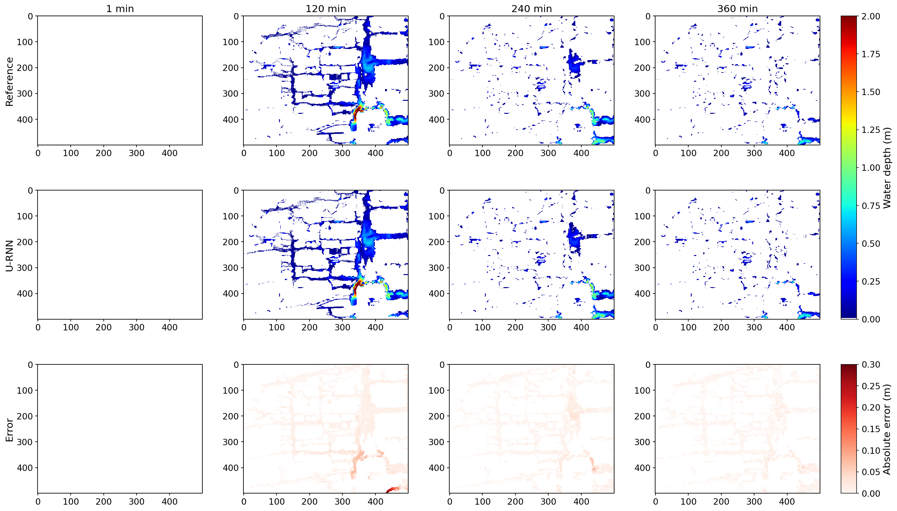

[← All tutorials](../README.md) · [Home](../../README.md) · **English** | [中文](../zh/04-inference.md)

# 4. Inference with Pre-trained Weights

> **Requirements:** pre-trained weights ([3. Pre-trained Weights](03-pretrained-weights.md)) + corresponding dataset ([2. Dataset Preparation](02-datasets.md)) &nbsp;|&nbsp; any GPU &nbsp;|&nbsp; ~5 min

```bash
cd code   # the inner code directory

# Location1 full-res (UrbanFlood24, 500×500)
python test.py --exp_config configs/location1_scratch.yaml --timestamp 20240202_162801_962166

# Location1 lite (UrbanFlood24 Lite, 128×128)
python test.py --exp_config configs/lite.yaml          --timestamp 20260316_130418_443889

# Futian (Shenzhen, 400×560)
python test.py --exp_config configs/futian_scratch.yaml --timestamp 20260316_134929_015563

# UKEA (UK, 52×120)
python test.py --exp_config configs/ukea_scratch.yaml  --timestamp 20260316_153558_270657
```

### Visualizations

For each test event, `test.py` saves a **3-row comparison figure** to `exp/<timestamp>/figs/epoch@<N>/<event>/water_depth_spatial_temporal.png`:

<p align="center"></p>

| Row | Content | Colorbar |
|---|---|---|
| Reference | Ground-truth water depth (MIKE+) | 0–2 m (jet) |
| U-RNN | Model prediction | 0–2 m (jet) |
| Error | Absolute error \|pred − ref\| | 0–0.3 m (Reds) |

Time snapshots are configurable via `--viz_time_points` (space-separated zero-indexed integers).

For full output details (logs, figure layout, metrics), see [7. Reference](07-reference.md).

---

## TensorRT acceleration (optional)

TensorRT accelerates inference by ~2–3× over PyTorch on the same GPU. This requires [TensorRT 10.0.0.6](https://developer.nvidia.com/tensorrt) (install via `pip install -r requirements_tensorrt.txt`).

### Step 1 — Convert the model

```bash
python urnn_to_tensorrt.py --exp_config configs/location1_scratch.yaml \
                           --timestamp 20240202_162801_962166
```

This creates `exp/<timestamp>/tensorrt/URNN.trt`.

### Step 2 — Run TensorRT inference

```bash
python test.py --exp_config configs/location1_scratch.yaml \
               --timestamp  20240202_162801_962166 --trt
```

---

Prev: [← 3. Pre-trained Weights](03-pretrained-weights.md) · Next: [5. Training →](05-training.md)
